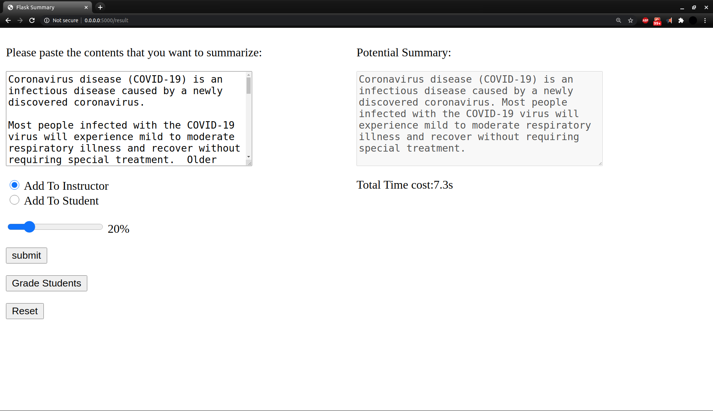

Features
--------
 * generate summary on given text

 Train and Use the model generate by BertSum
 -------------------------------------------
 please follow this [documents](https://github.com/Quan25/flask-summary/blob/master/guides.pdf) about how to train and use the model generated by BertSum

Installation In A Nutshell (on localhost)
--------------------------
 1. clone this project to your local disk
 ```
  git clone https://github.com/herre0/EssayScoringSystem.git
 ```

 2. Install [Flask](https://flask.palletsprojects.com/en/1.1.x/installation/#installation)
 3. Install [ROUGE-1.5.5](https://drive.google.com/file/d/1RxfZOYyNvzvCf37_vABfJMkohAsEZKtH/view?usp=sharing)
  - Install `libxml-parser-perl`, it is essential for installing ROUGE-1.5.5
  ```
    sudo apt-get install libxml-parser-perl
  ```
  - and make sure you can run this, which means the ROUGE is successfully installed
  ```
    ./runROUGE-test.pl
  ```
 4. Install pyrouge
 ```
  git clone https://github.com/bheinzerling/pyrouge.git
  cd pyrouge
  pip install -e .
 ```
 - Additional information can be found [here](https://github.com/bheinzerling/pyrouge) about how to install pyrouge and running the test

 5. Please install pytorch 1.1.0 with this comand
 - GPU
```
  conda install pytorch==1.1.0 torchvision==0.3.0 cudatoolkit=10.0 -c pytorch
```
 - CPU Only
```
  conda install pytorch-cpu==1.1.0 torchvision-cpu==0.3.0 cpuonly -c pytorch
```
 6. Download [pretrained-bert-model](https://s3.amazonaws.com/models.huggingface.co/bert/bert-large-uncased.tar.gz), and unzip it to a location you like
 7. Change the path in `BertParent.py` in `summarizer` folder
 ```
  self.model = BertModel.from_pretrained('/path/to/bert-large-uncased')
 ```
 8. Run `python app.py` in the flask-summary directory.
 9. Start web server by running `python app.py` while in the server_example directory.
 10. Browse the examples at [0.0.0.0:5000](http://0.0.0:5000) using a browser. *(defaults to port `5000`)*

 Screen Demo
 --------

